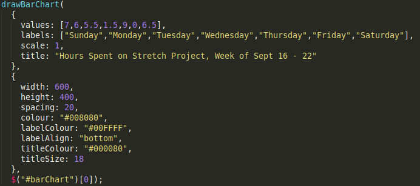
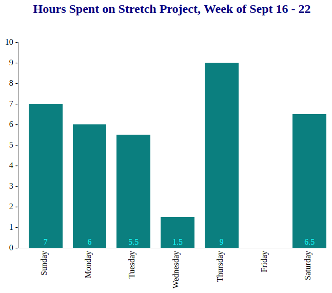
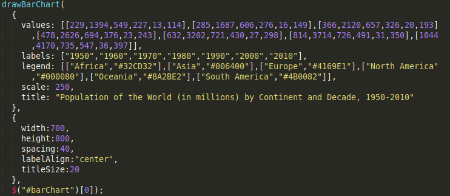

# stretch-project
***Bar Chart Stretch Project***

**ABOUT**

This library allows the user to create bar charts and stacked bar charts. The user enters the data to be displayed, the associated X-axis labels, the scale of the Y-axis, the title of the chart, and the legend colours and keys (for a stacked bar chart only). The user also has the option to enter a variety of features to alter the display of the chart.

**FEATURES**

The following features can be entered by the user to alter the display of the chart:

* the width and height of the chart area 
* the amount of whitespace between bars
* the colour of the bars 
* the colour and position (top, center, or bottom) of the labels displaying the values on the bars
* the colour and font size of the title displayed at the top of the chart 

The following features are determined automatically by the program:

* the width of the bars is determined based on the given number of bars, the specified width of the chart, and the specified amount of whitespace between bars
* the heights of the bars is determined based on the given values for the bars, the specified height of the chart, and the specified scale for the Y-axis

**FUNCTION**

The function call to create the chart is *drawBarChart*. The function takes in three parameters, as outlined below:

*data*: data is an object with four mandatory properties (for a single bar chart) or five mandatory properties (for a stacked bar chart), as defined below:
* *values*: for a single bar chart, values is an array of numbers (greater than or equal to zero) representing the values of the bars; for a stacked bar chart, values is an array of arrays of numbers (greater than or equal to zero), where each array represents a bar and the numbers within the array represent the values of the stacks within the bar (the arrays must be of the same length)
* *labels*: labels is an array of strings representing the labels to be displayed along the X-axis associated with each bar (must be the same length as values)
* *scale*: scale is a positive number representing the scale at which the values on the Y-axis will increase by
* *title*: title is a string representing the title to be displayed at the top of the chart
* *legend* - **only required for a stacked bar chart**: legend is an array of arrays of length two representing the key and colour associated with each stack in the bars (must be the same length as the arrays in values); the first element of each array is a string representing the key associated with the stack to be displayed in the legend, and the second element of each array is a string representing the colour of the associated stack (entered as its hex code value)

*options*: options is an object with up to eight optional properties, to modify the above listed features of the chart (if a property is not specified by the user, it will default to the value shown):
* *width*: natural number representing the width of the chart area in which the bars are displayed, measured in pixels (*default*: 500 px)
* *height*: natural number representing the height of the chart area in which the bars are displayed, measured in pixels (*default*: 300 px)
* *spacing*: whole number representing the amount of whitespace between bars, measured in pixels (*default*: 5 px)
* *colour*: string representing the colour of the bars, entered as its hex code value (*default*: green, hex code #008000) (*note*: not required for a stacked bar chart, as the colours of the stacks are specified in the legend)
* *labelColour*: string representing the colour of the labels displaying the value on the bar, entered as its hex code value (*default*: white, hex code #FFFFFF)
* *labelAlign*: string representing the position of the labels displaying the value on the bar as "top", "center", or "bottom" (*default*: top)
* *titleColour*: string representing the colour of the title displayed at the top of the chart (*default*: black, hex code #000000)
* *titleSize*: natural number representing the point size of title displayed at the top of the chart (*default*: 14 pt)

*element*: the jQuery element that the chart is rendered into: $("barChart")[0]

**EXAMPLES**

Example of a single bar chart in which no options are specified:

Example of a single bar chart in which all of the options are specified:

Example of a stacked bar chart in which some of the options are specified:

**BUGS**

* if the user enters a chart width and/or height which is too small for the given number of values, the chart will not display properly
* if the user enters a spacing option which is too large for the given chart width or number of bars, the chart will not display properly
* if the user enters a scale which is too small for the specified data, the Y-axis will not display properly
* if the length of values and labels is not equal, the chart will not display properly

**NEXT STEPS**

* allow the charts to display bars with negative values

**RESOURCES**

This [Youtube tutorial](https://www.youtube.com/watch?v=esa5hJegRfI) was used to help understand how to get my html, css, and javascript files all talking to each other.

[w3schools.com](https://www.w3schools.com/) was often used to learn about various functions and syntax.
